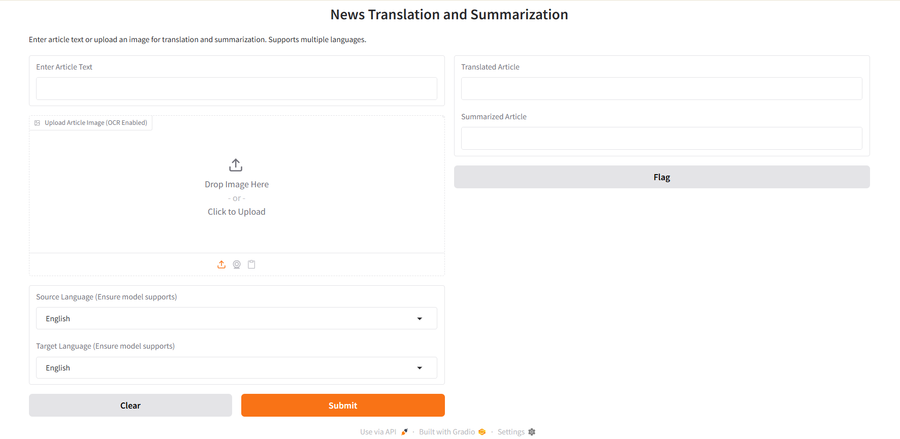
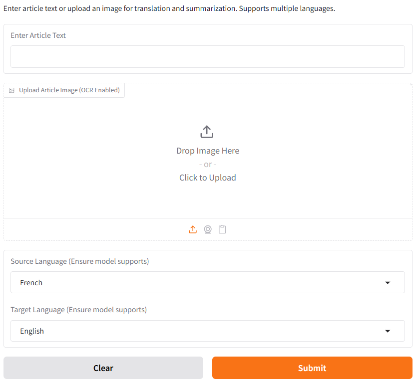
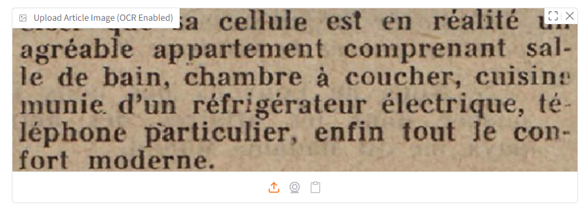
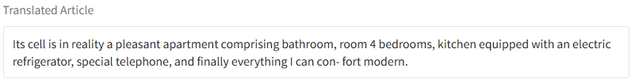
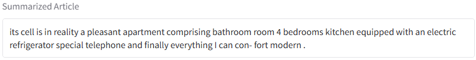

# 📰 News Translation and Summarization System

This project provides an end-to-end pipeline that performs **multilingual news translation** and **summarization** using powerful NLP models like **mBART50** and **T5**. It supports both **text input** and **image-based OCR input**, making it useful for automating the translation and summarization of global news content.

---

## 📌 Features

- 🔤 Supports input in **multiple languages** (e.g., French, German, Spanish, Russian)
- 🖼️ OCR-based **image input support** using Tesseract
- 🌍 Uses **mBART50** for high-quality multilingual translation
- ✂️ Uses **T5** for accurate and concise summarization
- 💻 User-friendly **Gradio interface**
- 🔒 No external APIs – fully local and privacy-safe
- 📚 Suitable for students, researchers, journalists, and educators

---

## 📷 Screenshots

### 🔹 Screenshot 1: Gradio Interface Launch  


### 🔹 Screenshot 2: Text Input and Language Selection  


### 🔹 Screenshot 3: Image Upload for OCR  


### 🔹 Screenshot 4: Translation Output  


### 🔹 Screenshot 5: Summarized Output  


---

## 🛠️ Tech Stack

| Component              | Technology                               |
|------------------------|-------------------------------------------|
| Programming Language   | Python 3.9+                               |
| Translation Model      | facebook/mbart-large-50-many-to-many-mmt |
| Summarization Model    | t5-base                                   |
| OCR Engine             | Tesseract OCR                             |
| UI Library             | Gradio                                    |
| Libraries Used         | transformers, torch, pytesseract, Pillow |

---

## ⚙️ Installation

```bash
# Clone the repository
git clone https://github.com/deepakyenechawandi/News_Translation_and_Summarization.git
cd News_Translation_and_Summarization

# Install dependencies
pip install -r requirements.txt

# (Optional) Install Tesseract OCR
# Ubuntu:
sudo apt update
sudo apt install tesseract-ocr

# Windows/macOS: Download from https://github.com/tesseract-ocr/tesseract
